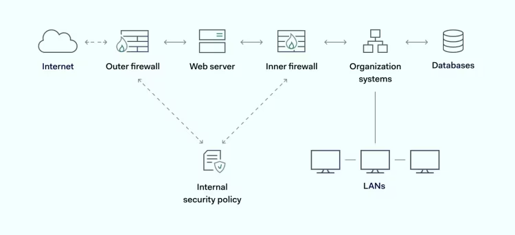

A firewall is a network security tool that creates a barrier between internal assets and the external internet. A firewall filters traffic, admitting approved data packets while excluding malicious traffic. It also helps with access control by approving verified identities and keeping out everyone else.

Every organization should protect its applications and data with a robust firewall. But how does a firewall work, and what are the different ways that firewalls filter traffic?

This article will explain what goes on behind the firewall. We will also look at the major filtering techniques, including packet filtering, stateful inspection, and proxy services. At the end of the article, you will be well-placed to choose the right security tools for your organization.

## Key takeaways
- Firewalls create an essential barrier, filtering network traffic to block malicious attempts while allowing legitimate data.
- Different firewall types, from packet filters to Next-Generation Firewalls (NGFWs), offer varying levels of inspection and protection.
- Both hardware and software firewalls play crucial roles, with hardware protecting networks and software securing individual devices.
- While firewalls are vital, they function best as part of a comprehensive security system alongside other tools like antivirus and IAM.
- Effective firewall implementation requires careful planning, balancing security needs with considerations like speed, cost, and scalability.

## Understanding firewalls
**Modern organizations exist in an environment full of digital threats.** Every week brings news of new data breaches or ransomware attacks. Governments constantly introduce new regulations to protect data, adding new penalties for companies with poor security systems.

In this context, network access is a critical corporate priority. Companies can suffer massive financial losses if they lose control of their digital perimeter. This makes it more important than ever to put in place effective firewall protection.

## What is a firewall?
A firewall is a network security system that **monitors and controls incoming and outgoing network traffic based on predetermined security rules.** A properly configured firewall allows verified users to access the network freely while denying access to unapproved devices.

It blocks many critical cybersecurity threats, such as DDoS bots and malware. While most effective when combined with antivirus software, threat detection technology, and access management systems, no organization can truly do without some form of firewall. Understanding how different firewall types vary is crucial for robust protection.

## The purpose of firewalls
In architecture, firewalls are barriers that contain fires, stopping blazes from moving between floors or rooms. The same principle applies when discussing what makes a digital firewall work. **Firewalls are hardware or software tools that block threats and limit access to network settings.** \

Firewalls are **the first barrier threats face when trying to access an organization's network perimeter.** They form the outer skin of network architecture, repelling most malicious agents before they can enter the network environment.

To carry out this role, **a firewall inspects all traffic crossing the network boundary.** But instead of waving traffic through, the firewall has to decide whether traffic is legitimate or not.

In this way, the firewall acts a little like nightclub security staff. If traffic has a ticket and passes security checks, it can enter the club. If not, there's no chance of gaining access.\

Advanced [types of firewalls](https://nordlayer.com/learn/firewall/types-of-firewalls/) have a few other functions besides filtering. For instance, they may gather data and provide threat reports to improve security. Some include load balancing to regulate network traffic. And others feature threat-neutralization tools. But **filtering is the major firewall** function and the core ability of every good firewall.

# How firewalls filter traffic
The best starting point for answering the question of how does a firewall work is separating hardware firewalls and software firewalls.

## Hardware firewalls 
Hardware firewalls are independent of the devices they protect. A [hardware firewall](https://nordlayer.com/learn/firewall/hardware/) will usually feature a separate appliance such as a broadband router that can connect to large numbers of network devices. Protection scales easily. This makes hardware firewalls a popular choice for defending on-premises networks.

## Software firewalls
Software firewalls are installed on the devices being protected. Windows Defender is the most common example, but there are many alternative providers. Software firewalls require installation and updating and protect a single device. But users can easily customize their filtering settings with a software firewall, making them a more precise solution.

Hardware and [software firewall](https://nordlayer.com/learn/firewall/software/) systems both filter data. And both come in many forms with different filtering methods. Let's quickly run through the core types of firewalls and explain how they divide legitimate and malicious traffic.

## Packet filtering
Packet filtering firewalls are the oldest and simplest types of firewalls. A [packet filtering](https://nordlayer.com/learn/firewall/packet-filtering/) firewall can be hardware or software-based, and will usually be installed at switches or network routers.

**Packet filtering assesses the surface of data packets.** Packets are segments of data created by transfer protocols when they dismantle files and reassemble them at destination devices. Every data packet has a header. This header includes various pieces of information that packet-filtering firewalls can use to allow or deny access.

Data inspected by packet filtering firewalls include:
- Internet Protocol (IP) address information
- Source and destination ports of incoming data
- Transfer protocols being used in the transfer

When incoming traffic arrives at a packet-filtering firewall, the appliance gathers as much header information as possible. It then **compares this information against pre-established security rules** (or [Access Control Lists](https://nordlayer.com/blog/the-role-of-access-control-lists/)). Any data packet that satisfies these security rules is admitted. If not, the packet filter firewall will deny access and the transmission is canceled.

Packet filter firewalls carry out relatively superficial inspection processes. However, this can still protect the internal network. For instance, **filtering IP addresses can admit approved devices**. This could include remote workers or third-party maintenance teams. If managers screen out unknown IP addresses, they can dramatically limit the threat surface.

Alongside IP address filtering, **packet filters can also limit accessible ports if required**. This can minimize the risks of port scanning - a common preparation for cyber attacks.

On the other hand, packet filters do not open packets and inspect the payload inside. This can limit their effectiveness. Firewalls will also forward approved traffic automatically to available ports. So limiting open ports may not be sufficient.

The limitations of packet filtering can also be strengths. This type of firewall is less resource-intensive. Packet filters are also faster. Both are useful traits in situations where security is not paramount.

## Circuit-level gateways
Circuit-level gateways **focus on data transfer protocols instead of the packet header**. In most cases, this involves checking the Transfer Control Protocol (TCP) handshake.

Inspecting the TCP handshake verifies that every stage of the data transmission is legitimate. If handshake flags like SYN or ACK are transmitted logically, the firewall will allow access. If not, the firewall will either deny access or request a re-transmission to prove that the transfer is legitimate.

## Stateful inspection
**Stateful inspection firewalls use information about the state of data transfers when making decisions.** In this setting, state refers to the context in which transfers occur. This includes much more information than packet headers can provide.

A stateful inspection firewall will usually carry out two filtering operations:
- **Packet inspection.** Stateful inspection checks every packet entering the network. The firewall gathers information about the origin and destination of incoming traffic. It detects the device in use, active ports, and transfer protocols.
- **TCP handshake verification.** Firewalls verify that each stage of the TCP handshake is followed properly. This applies to inbound and outbound connections.

Relevant data from the two stateful inspection stages are added to a state table. The firewall compares each packet to data contained within the state table. **This generates a deeper picture of who is seeking to access the network.**

**Stateful inspection firewalls tend to be more precise and secure than packet filters.** They leverage more data points and apply historical information to assess access requests. And they also contribute data to future filtering actions. The firewall "learns" more about network access over time, allowing it to make better decisions.

Because they process more data, [stateful firewall](https://nordlayer.com/learn/firewall/stateful/) appliances can be slower and consume more bandwidth. Users must balance these demands with improved network security.

## Proxy services
Also called application level gateways, a proxy service firewall stands between network devices and the external internet. A [proxy firewall](https://nordlayer.com/learn/firewall/proxy/) is a separate gateway with a distinct IP address. This means that until proxy firewalls approve access, data has no direct connection with internal assets.

**Using a proxy service firewall helps you protect your network by adding an extra layer of separation.** Cyber-attackers cannot directly access network resources. Instead, they must pass through the proxy and the firewall together. This dramatically reduces the risk of illicit intrusion.

Proxy firewalls apply handshake and packet filtering as described above. **But they may add deep packet inspection (DPI)** to the process. DPI examines data payloads within packets. This can expose infected packets and neutralize malware that would otherwise pass unnoticed.

While they generally deliver strong network security, proxies have some potential limitations:
- **Speed** - Because they add an extra appliance between networks and the internet, proxy usage can impact network traffic speeds. This can be a burden for digital businesses.
- **Compatibility** - Some common business applications are also incompatible with proxy firewalls. So they aren't always the best firewall option.
- **Web-only** - Some proxies only screen traffic entering web applications. Proxies may not be able to handle non-web traffic such as DDoS floods or DNS queries.

## NAT filtering
Network Address Translation (NAT) firewalls are another option when filtering traffic. In NAT systems all network devices connect to a single gateway. Local devices have separate private [IP addresses](https://nordlayer.com/learn/other/what-is-an-ip-address/), but they share the IP address of the gateway.

A NAT firewall is part of this architecture. It only accepts incoming web traffic if it has been requested by a private IP address on the NAT system.

This type of firewall is often used in educational settings where it's important to block inappropriate websites. But NAT firewalls run into problems when interacting with external cloud or web applications.

## Next-generation firewalls
[Next-generation firewalls](https://nordlayer.com/learn/firewall/next-generation/) (NGFWs) are the most up-to-date option when defending a private network. They are often called multilayer firewalls as they **inspect traffic between OSI layers 2-7**. By comparison, stateful firewalls generally inspect network traffic between layers 2-4.

Because they work at a wide OSI range, NGFWs can filter network traffic in far more detail. A next-generation firewall inspects the content of data packets. It applies insights from intrusion prevention systems (IPS).

Next-generation firewalls also **incorporate context from other sources**, such as [IAM software](https://nordlayer.com/identity-access-management/) and global threat databases. This makes it easier to detect recently identified malware. It also makes it easier to differentiate verified users from potentially malicious code.

NGFWs are the best way to maximize network security. On the other hand, they come with a higher price tag and consume the most network data. These factors make them an unsuitable network security device for many smaller organizations.

# How exactly does a firewall protect data?
Data on your private network requires protection from external attackers. This applies whether data is held locally on company servers or stored in cloud containers. And the first step in protecting data is adding firewall filters to screen out malicious actors.

Firewall security can block a wide range of cyber threats and reduce the risks posed by others:
- [**Denial-of-Service**](https://nordlayer.com/learn/threats/denial-of-service/). Distributed denial-of-service attacks mobilize huge quantities of bots to flood targeted systems with network traffic. Bots continue to make access requests while hiding their original identity. Servers cannot verify the connection, but they continue to send authentication requests. Eventually, the target is taken offline. Smart firewalls protect your network by detecting DDoS floods before the attack becomes critical. This reduces the risk of downtime and damage to vital network resources.
- **Spam**. Spam can also flood network users with useless messages or – worse – [malicious software](https://nordlayer.com/learn/threats/malware/). These links can lead to malware infections and ransomware attacks. Both threats can cripple network operations. A good firewall will filter spam from legitimate traffic and screen emails before users can click dangerous links.
- [**Backdoors**](https://nordlayer.com/learn/threats/backdoor-attack/). Important network applications or operating systems may include backdoors that allow unauthorized access. These loopholes can lead to application hijacking and data theft. Companies often fail to apply patches as backdoors are identified. Firewalls defend your network by screening out unverified users. Hackers will have to work far harder to gain access to compromised apps.
- **Remote hijackings**. Sometimes, third parties may gain remote access to network devices. This is usually a legitimate task for maintenance purposes. But hackers can also gain remote access via partner organizations or poorly secured remote work tools. Firewalls check device data, adding an extra set of filters. This should make it harder to capture devices remotely.
- [**Viruses**](https://nordlayer.com/learn/threats/computer-virus/). Viruses arrive on an internal network via conventional traffic and can sometimes be hard to spot. But firewalls can use deep packet inspection to look for malicious code. Applying deep inspection is therefore advisable for high-priority devices. But firewalls do not ensure total virus protection. Robust anti-malware and antivirus protection are also vital.
- **Macros**. Macros are scripts for use with Microsoft Office applications like Word and Excel. When launched, macros can spread well beyond Microsoft apps, compromising entire networks. They are usually transmitted as email attachments. So if firewalls have email filters, they provide a degree of protection.

As the list above suggests, firewalls play a crucial role in protecting data. But **firewall filtering alone is not a solution.** It is just part of an effective network security system.

Companies must combine an effective firewall appliance with virus scanners, [threat intelligence](https://nordlayer.com/learn/threat-management/threat-intelligence/), data prevention tools, encryption, and [identity and access management (IAM)](https://nordlayer.com/learn/iam/what-is-iam/) systems.